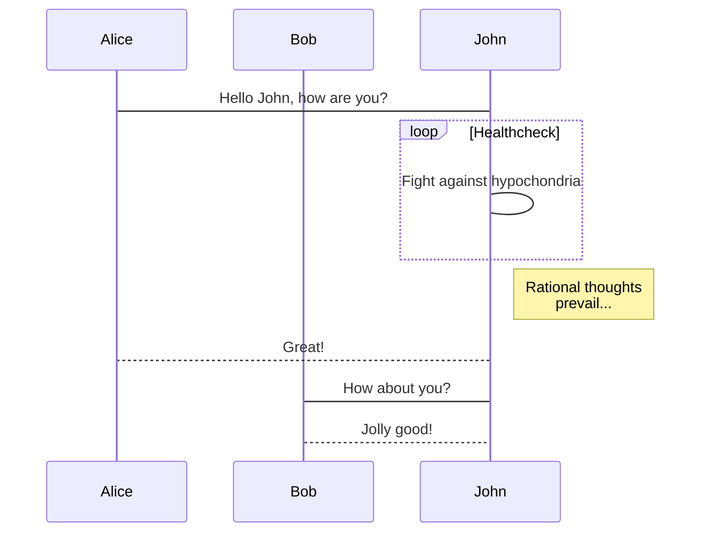
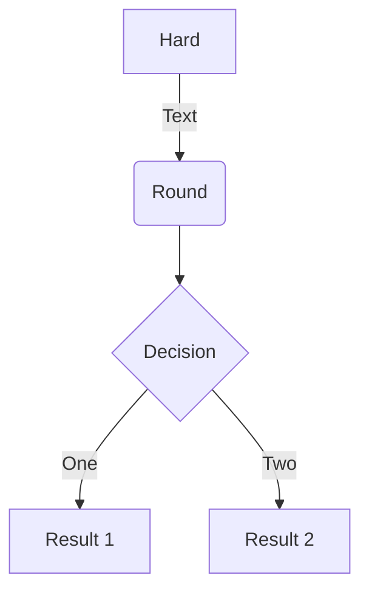
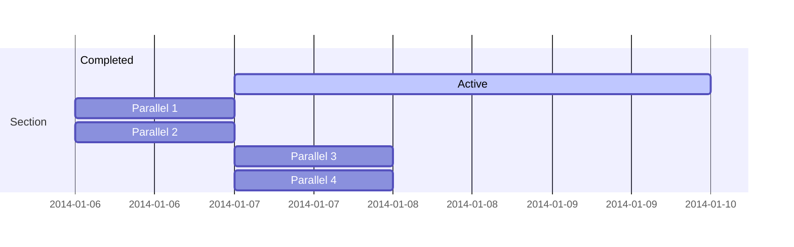
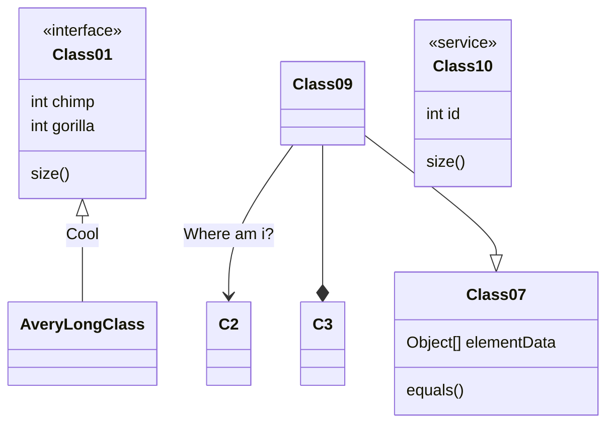
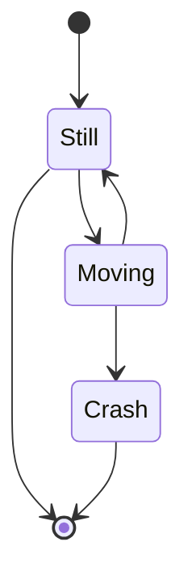
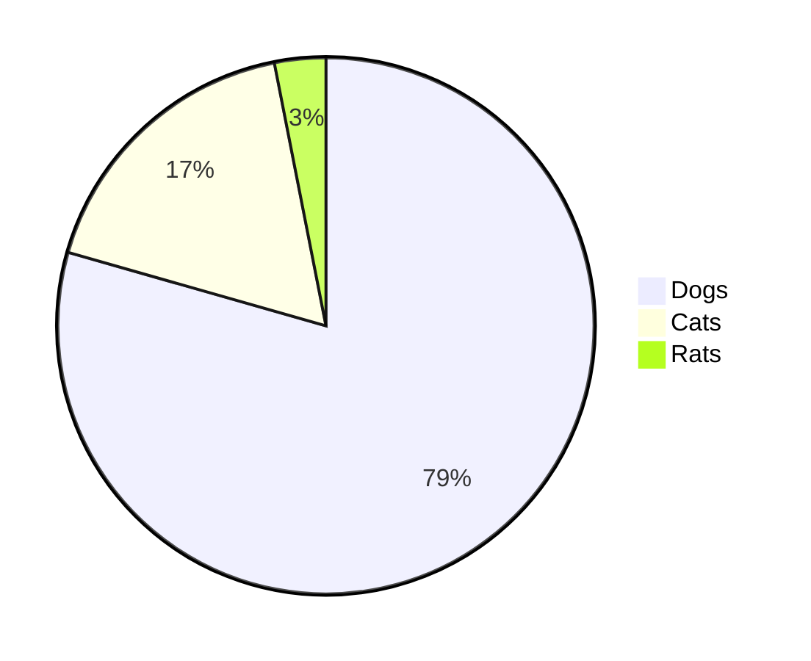



# h1 (Dont use)
---

## h2
Content Can be present within this

### h3
This is subcontent


## Highighting 
Something wihtin this `Highlighted`

Most <mark>salamanders</mark> are nocturnal, and hunt for insects, worms, and other small creatures.


## Code

### Tabbed Code

  
  ```java
  System.out.println('Hello World!');
  ```
  
  
  ```javascript
  console.log('Hello World!');
  ```
  


### Highlight Code

<!DOCTYPE html>
<html lang="en">
<head>
  <meta charset="UTF-8">
  <title>Example HTML5 Document</title>
</head>
<body>
  <p>Test</p>
</body>
</html>



## Blockquote with attribution

> Don't communicate by sharing memory, share memory by communicating.</p>
> — <cite>Rob Pike[^1]</cite>
[^1]: The above quote is excerpted from Rob Pike's [talk](https://www.youtube.com/watch?v=PAAkCSZUG1c) during Gopherfest, November 18, 2015.

## Tables

Tables aren't part of the core Markdown spec, but Hugo supports supports them out-of-the-box.

   Name | Age
--------|------
    Bob | 27
  Alice | 23

## Subscript/Superscript/Keyboard
H<sub>2</sub>O

X<sup>n</sup> + Y<sup>n</sup>: Z<sup>n</sup>

Press <kbd><kbd>CTRL</kbd>+<kbd>ALT</kbd>+<kbd>Delete</kbd></kbd> to end the session.


## Shortcodes

### Button
button


### Box

Some markdown contents


### Expand
Some **Markdown** Contents

### Tabs

  
  ### Windows section

  ```javascript
  console.log('Hello World!');
  ```
  

  
  ### MacOS section
  Hello world!
  

  
  ### Ubuntu section
  Great!
  


### Image


### Alerts
warning, success, info, danger

**this** is a text


### Notice
success, info, warning, error
 
success


### Instagram Simple Shortcode



<br>

### YouTube Privacy Enhanced Shortcode



<br>

### Twitter Simple Shortcode



## Cool Diagrams

### Viz(TOC)

Set in metadata
libraries:
-viz


```viz-dot
  digraph G {

	subgraph cluster_0 {
		style=filled;
		color=lightgrey;
		node [style=filled,color=white];
		a0 -> a1 -> a2 -> a3;
		label = "process #1";
	}

	subgraph cluster_1 {
		node [style=filled];
		b0 -> b1 -> b2 -> b3;
		label = "process #2";
		color=blue
	}
	start -> a0;
	start -> b0;
	a1 -> b3;
	b2 -> a3;
	a3 -> a0;
	a3 -> end;
	b3 -> end;

	start [shape=Mdiamond];
	end [shape=Msquare];
}

```

### Wavedrom(DLD)
set in front matter
libraries:
-wavedrom

```wave
{ 
  "signal": [ {"name": "CLK", "wave": "p.....|..."},
            {"name":"DAT", "wave":"x.345x|=.x", "data":["A","B","C","D"]},
            {"name": "REQ", "wave": "0.1..0|1.0"},
            {},
            {"name": "ACK", "wave": "1.....|01."}
]}
```

### Chart
front matter
libraries:
-chart


```chart
{
    "type": "bar",
    "data": 
       {
        "labels": ["One", "Two", "Three", "Four", "Five", "Six"],
        "datasets": [{
            "label": "# of Votes",
            "data": [12, 19, 3, 5, 3, 8]
        }]
    }
}
```

```chart
    {
    "type": "line",
        "data": {
            "labels": ["One", "Two", "Three", "Four", "Five", "Six"],
            "datasets": [
            {
                "label": "# of Votes",
                "data": [12, 19, 3, 5, 2, 3],
                "backgroundColor":"transparent",
                "borderColor":"orange"
            },
            {
                "label": "Some other set",
                "data": [15, 8, 13, 5, 5, 9],
                "backgroundColor":"transparent",
                "borderColor":"#44ccff"
            }
            ]
        }
    }
```

### Sequence Diagram

libraries:
-msc


```msc
Alice->Bob: Hello Bob, how are you?
Note right of Bob: Bob thinks
Bob-->Alice: I am good thanks!
```

```msc
Title: Here is a title
A->B: Normal line
B-->C: Dashed line
C->>D: Open arrow
D-->>A: Dashed open arrow
```

### Mermaid

libraries:
-mermaid














### Flowchart
libraries:
-flowchartjs


```flowchart
st=>start: Start|past:>http://www.google.com[blank]
e=>end: End|future:>http://www.google.com
op1=>operation: My Operation|past
op2=>operation: Stuff|current
sub1=>subroutine: My Subroutine|invalid
cond=>condition: Yes
or No?|approved:>http://www.google.com
c2=>condition: Good idea|rejected
io=>inputoutput: catch something...|future

st->op1(right)->cond
cond(yes, right)->c2
cond(no)->sub1(left)->op1
c2(yes)->io->e
c2(no)->op2->e
```


<br>
